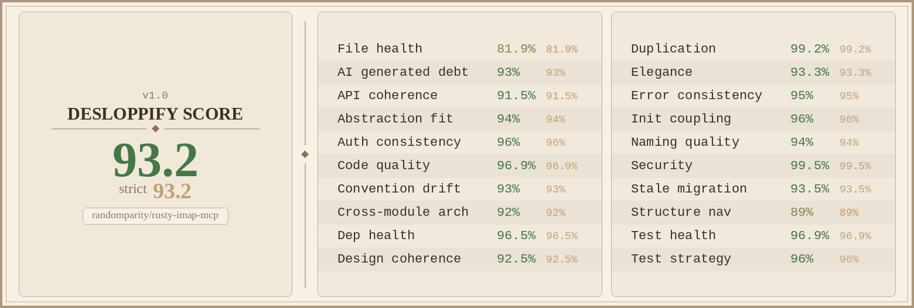

# rusty-imap-mcp

[](https://github.com/randomparity/rusty-imap-mcp/actions/workflows/ci.yml)
[](https://github.com/randomparity/rusty-imap-mcp/releases)
[](LICENSE-MIT)
[](rust-toolchain.toml)

A security-first [Model Context Protocol](https://modelcontextprotocol.io/)
server for IMAP email, written in Rust.

## Why this exists

LLM agents with email access are targets for prompt injection. A single
crafted message can contain hidden instructions that cause an agent to
send mail, leak data, or pivot to other tools. Most MCP email servers
pass raw message content straight to the model.

rusty-imap-mcp treats every byte of email content as untrusted input.
Messages are parsed, sanitized, normalized, and structurally tagged
before reaching the agent — so the model sees clean content with
security metadata, not raw attack surface.

## Features

### Content defense

- HTML sanitization with hidden-element stripping (CSS `display:none`,
  `visibility:hidden`, `opacity:0`, white-on-white text)
- Unicode NFKC normalization and invisible character stripping
  (zero-width, bidi overrides, C0/C1 controls)
- Look-alike detection: mixed-script domains, confusable skeletons,
  display-name spoofing, reply-to mismatch, filename bidi tricks
- Structured response envelope separating trusted `meta` from
  `untrusted` content and `security_warnings`
- Mailing list detection and content provenance tagging

### Authorization

- Four security postures: `readonly`, `draft-safe` (default), `full`,
  `destructive`
- Per-tool `"allow"` / `"deny"` overrides
- Denied tools hidden from `list_tools` and rejected at dispatch
- `$PendingReview` flag on drafts — human-in-the-loop gate

### Audit and limits

- Append-only JSONL audit log with tamper detection
- Token-bucket rate limiting (per-tool, per-account)
- Circuit breaker with sliding-window error counting
- TLS certificate fingerprint pinning

### Email operations

- 22 posture-gated tools: list, search, fetch, export, flag, label,
  move, draft, send, forward, folder management, attachment download
- 2 infrastructure tools: `list_accounts`, `use_account`
- 24 dispatchable tools total
- Multi-account support with per-account posture, rate limits, and
  circuit breaker
- SMTP sending with automatic Sent-folder copy via IMAP APPEND

### Operations

- Single static binary — no runtime dependencies
- Pre-built binaries for 5 platforms (x86_64/aarch64 Linux, aarch64
  macOS, ppc64le, s390x)
- TOML configuration with strict validation
- OS keychain credential storage (no passwords in config files)
- `--dry-run` mode for connection testing

## How it compares

| Feature | rusty-imap-mcp | [mcp-email-server](https://github.com/ai-zerolab/mcp-email-server) | [email-mcp](https://github.com/codefuturist/email-mcp) | [read-no-evil-mcp](https://github.com/thekie/read-no-evil-mcp) |
|---------|:-:|:-:|:-:|:-:|
| **Security** | | | | |
| Content sanitization | yes | no | no | no |
| Prompt injection defense | structural | no | no | ML (72% detection) |
| Unicode normalization | yes | no | no | no |
| Invisible char stripping | yes | no | no | partial |
| Look-alike detection | yes | no | no | no |
| Security postures | 4 tiers + per-tool | no | no | per-account perms |
| Audit log | append-only JSONL | no | audit trail | no |
| TLS fingerprint pinning | yes | no | no | no |
| Rate limiting | token-bucket | no | token-bucket | no |
| Circuit breaker | yes | no | no | no |
| **Capabilities** | | | | |
| Tool count | 24 | ~10 | 47 | 7 |
| Multi-account | yes | yes | yes | yes |
| SMTP send | yes | yes | yes | yes |
| Credential storage | OS keychain | env vars | config file | env vars |
| IMAP IDLE / watcher | no | no | yes | no |
| Email scheduling | no | no | yes | no |
| **Runtime** | | | | |
| Language | Rust | Python | TypeScript | Python |
| Install | single binary | `pip` / `uvx` | `npx` / `pnpm` | `pip` + PyTorch (~500 MB) |
| Docker | no | yes | yes | yes |

Based on public documentation as of April 2026. Corrections welcome
via issue or PR.

## Get started

Pick your email provider:

- **[Quick start: Gmail](docs/quickstart-gmail.md)** — ~10 minutes,
  requires an App Password
- **[Quick start: Proton Bridge](docs/quickstart-proton-bridge.md)** —
  ~15 minutes, includes TLS fingerprint setup

For other IMAP servers (Fastmail, Dovecot, Cyrus, etc.), follow the
Gmail guide and adjust the `host`, `port`, and `encryption` fields for
your provider.

Prefer to start from a full annotated config? Copy
[`config.example.toml`](config.example.toml) (single account) or
[`config.multi-account.example.toml`](config.multi-account.example.toml)
(several mailboxes) and edit the values.

## MCP tools

**22 posture-gated tools:**

- **Read:** `list_folders`, `search`, `fetch_message`,
  `list_attachments`, `download_attachment`, `list_labels`
- **Export:** `export_messages` — denied in every posture by default;
  enable with `export_messages = "allow"` under `[security.tools]`
  (see [The `export_messages` tool](docs/configuration.md#the-export_messages-tool))
- **Mutate:** `mark_read`, `mark_unread`, `flag`, `unflag`,
  `add_label`, `remove_label`, `move_message`, `create_draft`
- **Manage:** `send_email`, `forward`, `delete_message`, `create_folder`,
  `rename_folder`, `expunge`, `delete_folder`

`create_draft` and `send_email` accept optional sandbox-sourced `attachments`
(read only from the download root; see
[Compose attachments and HTML](docs/postures.md#compose-attachments-and-html))
and a sanitized `body_html` alternative (gated at `full`).

`search`'s content-search arguments (`advanced_query`, `body`, `text`,
`bcc`, `headers`), `fetch_message`'s `include_html` argument, and
`create_draft`'s `body_html` argument are gated sub-capabilities
(`search.advanced_query`, `fetch_message.include_html`,
`create_draft.include_html`) requiring `full` posture or above — they
are not separate MCP tools.

**2 infrastructure tools** (always available):
`use_account`, `list_accounts`

24 dispatchable tools total. See [docs/postures.md](docs/postures.md)
for the full 25-capability x 4-posture matrix (the three gated
sub-capabilities above are counted as separate rows there).

## Compatibility

rusty-imap-mcp accepts MCP protocol version `2025-11-25` only — it
does not negotiate down to older versions a client requests. Every
mainstream MCP host (Claude Desktop, Claude Code, Claude.ai, Cursor,
VS Code, etc.) has negotiated `2025-11-25` by default since that
revision became the MCP spec's latest; an older host will fail the
handshake instead of connecting with reduced capabilities. See
[Unsupported protocol version during initialize](docs/troubleshooting.md#unsupported-protocol-version-during-initialize)
for the exact error text and why there's no fallback.

## Build from source

```bash
git clone https://github.com/randomparity/rusty-imap-mcp.git
cd rusty-imap-mcp
cargo build --release
```

Requires Rust 1.88.0+ and `libdbus-1-dev` (Linux) or equivalent.

### Development

```bash
just setup    # install required tooling and pre-commit hooks
just ci       # run the full local-CI equivalent
```

## Homebrew

On macOS (Apple Silicon) and Linux (x86_64 / aarch64):

```bash
brew install randomparity/tap/rusty-imap-mcp
```

or, as two steps:

```bash
brew tap randomparity/tap
brew install rusty-imap-mcp
```

Intel Macs build from source via a build-time `rust` dependency (no prebuilt
Intel-macOS binary). See [`homebrew/README.md`](homebrew/README.md).

## Pre-built binaries

Tarballs are published for five targets on each
[release](https://github.com/randomparity/rusty-imap-mcp/releases):
`x86_64-unknown-linux-gnu`, `aarch64-unknown-linux-gnu`,
`aarch64-apple-darwin`, `powerpc64le-unknown-linux-gnu`,
`s390x-unknown-linux-gnu`. Each release also attaches `SHA256SUMS.txt`
and a [build provenance
attestation](https://github.com/randomparity/rusty-imap-mcp/attestations)
over every tarball.

The `x86_64-unknown-linux-gnu`, `aarch64-unknown-linux-gnu`, and
`aarch64-apple-darwin` tarballs are self-contained. The
`powerpc64le-unknown-linux-gnu` and `s390x-unknown-linux-gnu` tarballs link
libdbus dynamically and require a system `libdbus-1-3` at runtime.

Each release also attaches native `.deb`/`.rpm` packages (amd64/arm64), an
`install.sh` one-line installer, and manpages inside every tarball
(`share/man/man1/`).

### One-line installer

Two paths, depending on how much you want to verify:

- **Convenience** — resolves and installs the latest stable release:

  ```bash
  curl -fsSL https://raw.githubusercontent.com/randomparity/rusty-imap-mcp/main/install.sh | sh
  ```

  This trusts GitHub's origin over TLS and the script it fetches; the piped
  script is **not** independently checksum-verified. If the unauthenticated
  GitHub API is rate-limited (common behind shared NAT/CI), pin a version:
  `RUSTY_IMAP_MCP_VERSION=vX.Y.Z`. Override the target dir with
  `RUSTY_IMAP_MCP_INSTALL_DIR` (default `$HOME/.local/bin`).

- **Verifiable** — download the release-asset `install.sh`, check it against
  `SHA256SUMS.txt`, then run it (pinned version, no API call — the file you
  verify is the file you run).

The installer's SHA-256 check is **integrity, not authenticity**:
`SHA256SUMS.txt` comes from the same unsigned release origin, so it catches a
corrupted download, not a tampered release. For authenticity, verify the
[build provenance attestation](https://github.com/randomparity/rusty-imap-mcp/attestations)
on the downloaded tarball or package with `gh attestation verify`.

### Distribution packages (.deb / .rpm)

Download the `.deb` (Debian/Ubuntu) or `.rpm` (Fedora/RHEL) for amd64 or arm64
from the [releases page](https://github.com/randomparity/rusty-imap-mcp/releases)
and install it:

```bash
sudo apt install ./rusty-imap-mcp_X.Y.Z-1_amd64.deb   # or: sudo dnf install ./rusty-imap-mcp-X.Y.Z-1.x86_64.rpm
man rusty-imap-mcp
```

The packaged amd64/arm64 binary static-links libdbus, so **no** `libdbus-1-3` /
`dbus-libs` runtime package is needed. Both packages are built against
**glibc 2.36** (Debian 12+, Ubuntu 24.04+, Fedora 37+) and declare that floor,
so `apt`/`dnf` refuse cleanly on older systems; there, use `cargo install
rusty-imap-mcp --locked` or build from source instead. The `curl … | sh`
installer places only the binary — its manpage ships inside the tarball under
`share/man/man1/`, or run `rusty-imap-mcp --help`.

### Installing a prebuilt binary

1. Download the tarball for your platform and `SHA256SUMS.txt` from the
   [releases page](https://github.com/randomparity/rusty-imap-mcp/releases).
2. Verify the checksum before running anything you downloaded:

   ```bash
   sha256sum --ignore-missing -c SHA256SUMS.txt
   ```

3. Extract it and put the binary on your `$PATH`:

   ```bash
   tar xzf rusty-imap-mcp-vX.Y.Z-<target-triple>.tar.gz
   mv rusty-imap-mcp-vX.Y.Z-<target-triple>/rusty-imap-mcp ~/.local/bin/rusty-imap-mcp
   ```

4. **macOS only:** Gatekeeper quarantines binaries downloaded via a
   browser and refuses to run them ("cannot be opened because the
   developer cannot be verified"). The `aarch64-apple-darwin` binary is
   not yet codesigned or notarized, so remove the quarantine attribute
   before running it:

   ```bash
   xattr -d com.apple.quarantine ~/.local/bin/rusty-imap-mcp
   ```

   Alternatively, right-click the binary in Finder, choose **Open**,
   and confirm the warning once.

   Codesigning and notarization (and an MCPB bundle for one-click
   Claude Desktop install) are tracked for a future release; until
   then, always verify the SHA256 checksum first.

## Documentation

- [Configuration reference](docs/configuration.md)
- [Security model and posture matrix](docs/security-model.md)
- [Multi-account support](docs/multi-account.md)
- [Audit log format](docs/audit-log.md)
- [Troubleshooting](docs/troubleshooting.md)
- [Full documentation index](docs/INDEX.md)

## Troubleshooting

- **MCP client reports `Connection closed` / `MCP error -32000` at
  startup** — the server exited before completing the handshake; the
  real error went to stderr. See
  [docs/troubleshooting.md](docs/troubleshooting.md) for the
  `--dry-run` and stderr-capture workflow.
- **`rusty-imap-mcp` exits at startup with `audit file ... is already locked`** —
  another `rusty-imap-mcp` process holds the audit lock. Each MCP
  client must use a distinct `[audit].path`; see
  [Running multiple MCP clients](docs/audit-log.md#running-multiple-mcp-clients)
  for the configuration pattern.
- **MCP client rejects the server at startup with `Unsupported
  protocol version: '<version>'. Server supports: 2025-11-25.`** —
  your MCP host is negotiating an older protocol version;
  rusty-imap-mcp requires an exact match and does not fall back. See
  [Compatibility](#compatibility) and
  [Unsupported protocol version during initialize](docs/troubleshooting.md#unsupported-protocol-version-during-initialize)
  for why, and update your MCP host.

## License

Dual-licensed under MIT OR Apache-2.0. See `LICENSE-MIT` and
`LICENSE-APACHE`.

## Security

See [`SECURITY.md`](SECURITY.md) for responsible disclosure and the
threat model summary.

## Code quality



Generated by [`desloppify`](https://github.com/peteromallet/desloppify)
against the current `main` branch. The 19 sub-scores cover file
health, API coherence, test strategy, security posture, dependency
hygiene, and more. Regenerate locally with `/desloppify` from Claude
Code.
